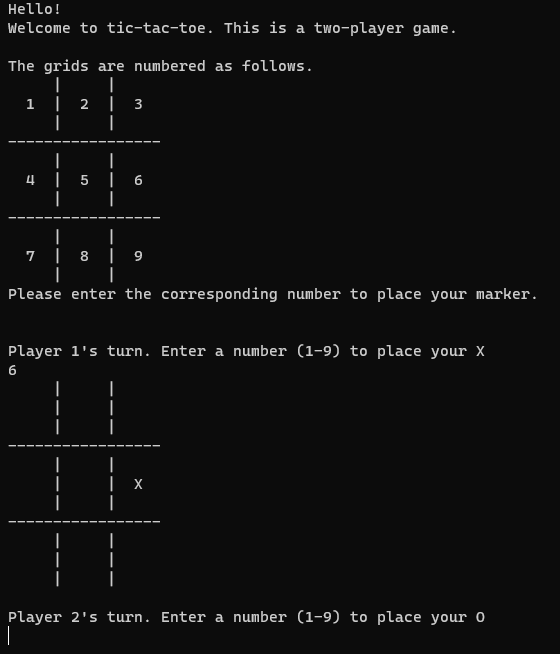
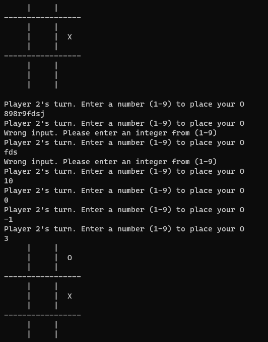

# Tic-Tac-Toe
A two-player console (terminal-based) game

# Gameplay

The game starts off as shown below. The grids are labelled and the user can place their X's and O's by typing in the corresponding labels.
 

---
To prevent unwanted crashes, inputs are checked to ensure that they are valid
 

---
The win screen is shown as below. The user is prompted to play again.
 

---
# What I learned
* The use of arrays and pointers
* Object Oriented Programming
* Creation of an object instance using a given class
* Use of methods
* Abstraction using access specifiers
* Dynamic Memory Allocation
* Constructors and Destructors
* Input stream type checking
